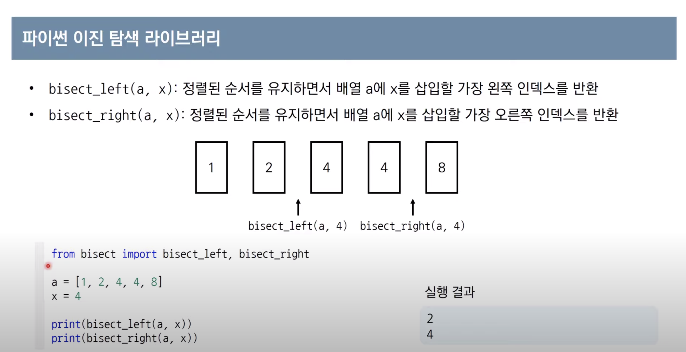
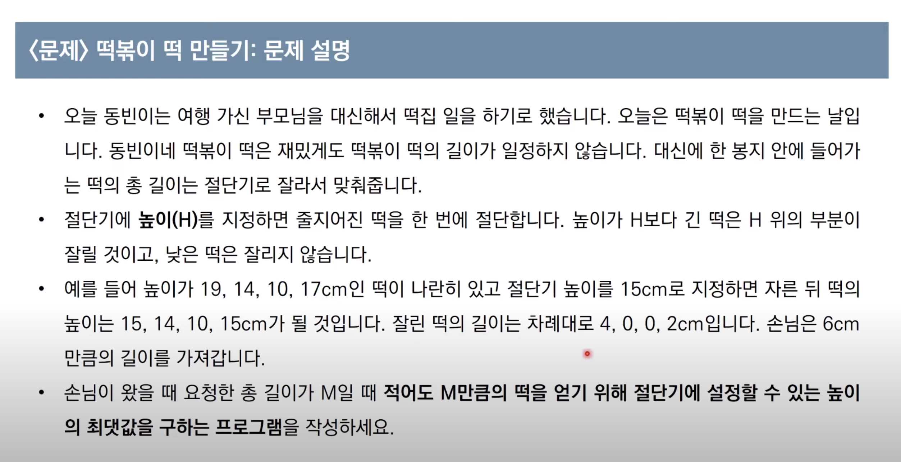
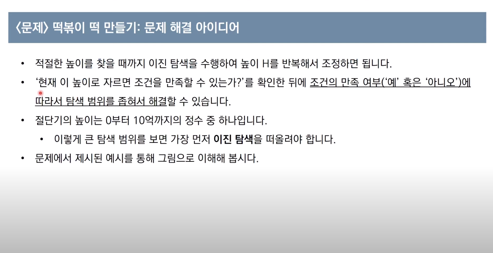
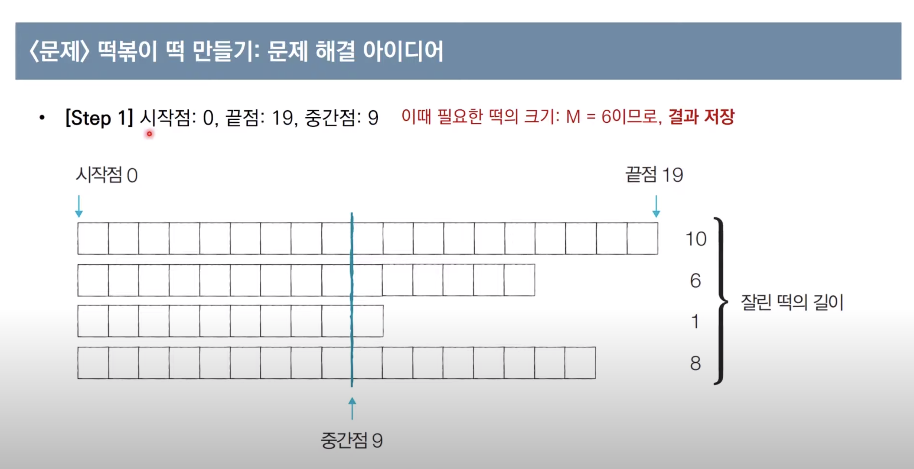
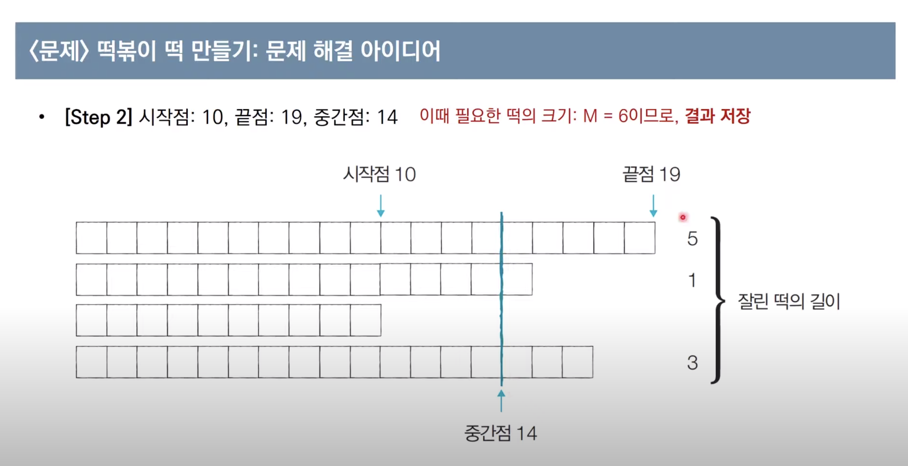

# 이진탐색 알고리즘

이진 탐색 : `정렬되어 있는 리스트`에서 탐색 범위를 `절반씩` 좁혀가며 데이터를 탐색하는 방법 
- 시간 복잡도는 `O(LogN)`을 보장함 !

파이썬 이진 탐색 라이브러리

- bisect_left(a ,x) : 정렬된 순서를 유지하면서 배열 a에 x를 삽일할 가장 왼쪽 인덱스를 반환
- bisect_right(a ,x) : 정렬된 순서를 유지하면서 배열 a에 x를 삽일할 가장 오른쪽 인덱스를 반환




```python
from bisect import bisect_left, bisect_right

# 값이 [left_value, right_value]인 데이터의 개수를 반환하는 함수
def count_by_range(a, left_value, right_value):
    right_index = bisect_right(a, right_value)
    left_index = bisect_left(a, left_value)
    return right_index - left_index

a = [1, 2, 3, 3, 3, 3, 4, 4, 8 ,9]

# 값이 4인 데이터 개수 출력
print(count_by_range(a, 4, 4)) # 2

# 값이 -1 ~ 3 범위에 있는 데이터 개수 출력
print(count_by_range(a, -1, 3)) # 6
```


## 문제 예시







#### 풀이 코드 - Python

```python
# 떡의 개수(N)와 요청한 떡의 길이(M)을 입력
n, m = list(map(int, input().split(' ')))
# 각 떡의 개별 높이 정보를 입력
array = list(map(int, input().split()))

# 이진 탐색을 위한 시작점과 끝점 설정
start = 0
end = max(array)

# 이진 탐색 수행 (반복적)
result = 0
while(start <= end):
    total = 0
    mid = (start + end) // 2
    for x in array:
        # 잘랐을 때의 떡볶이 양 계산
        if x > mid:
            total += x - mid
    # 떡볶이 양이 부족한 경우 더 많이 자르기 (오른쪽 부분 탐색)
    if total < m:
        end = mid - 1
    # 떡볶이 양이 충분한 경우 덜 자르기 (왼쪽 부분 탐색)
    else:
        result = mid # 최대한 덜 잘랐을 때가 정답이므로, 여기에서 result에 기록
        start = mid + 1

# 정답 출력
print(result)
```

#### 풀이 코드 - Java

```java
import java.util.*;

public class Main {

    public static void main(String[] args) {
        Scanner sc = new Scanner(System.in);
        
        // 떡의 개수(N)와 요청한 떡의 길이(M)
        int n = sc.nextInt();
        int m = sc.nextInt();

        // 각 떡의 개별 높이 정보 
        int[] arr = new int[n];
        for (int i = 0; i < n; i++) {
            arr[i] = sc.nextInt();
        }

        // 이진 탐색을 위한 시작점과 끝점 설정
        int start = 0;
        int end = (int) 1e9;
        // 이진 탐색 수행 (반복적)
        int result = 0; 
        while (start <= end) {
            long total = 0;
            int mid = (start + end) / 2;
            for (int i = 0; i < n; i++) {
                // 잘랐을 때의 떡의 양 계산
                if (arr[i] > mid) total += arr[i] - mid; 
            }
            if (total < m) { // 떡의 양이 부족한 경우 더 많이 자르기(왼쪽 부분 탐색)
                end = mid - 1;
            }
            else { // 떡의 양이 충분한 경우 덜 자르기(오른쪽 부분 탐색)
                result = mid; // 최대한 덜 잘랐을 때가 정답이므로, 여기에서 result에 기록 
                start = mid + 1;
            }
        }

        System.out.println(result);
    }

}
```